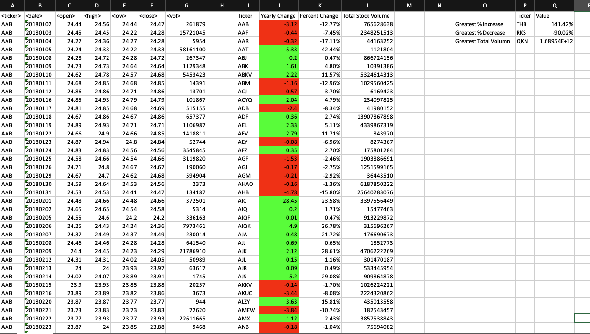
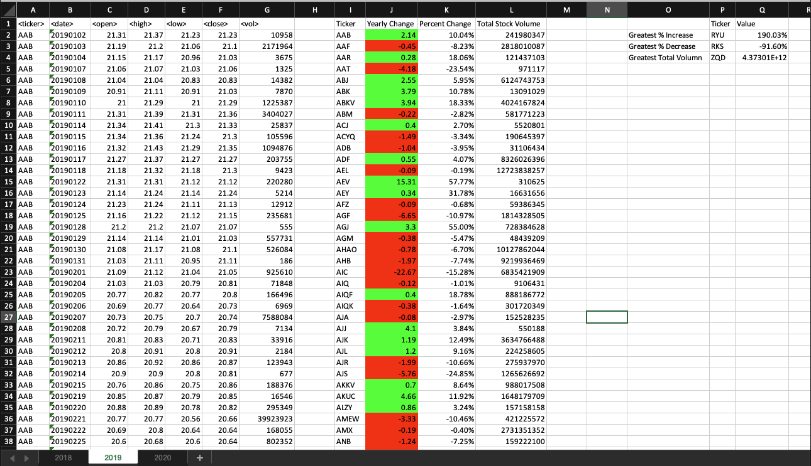
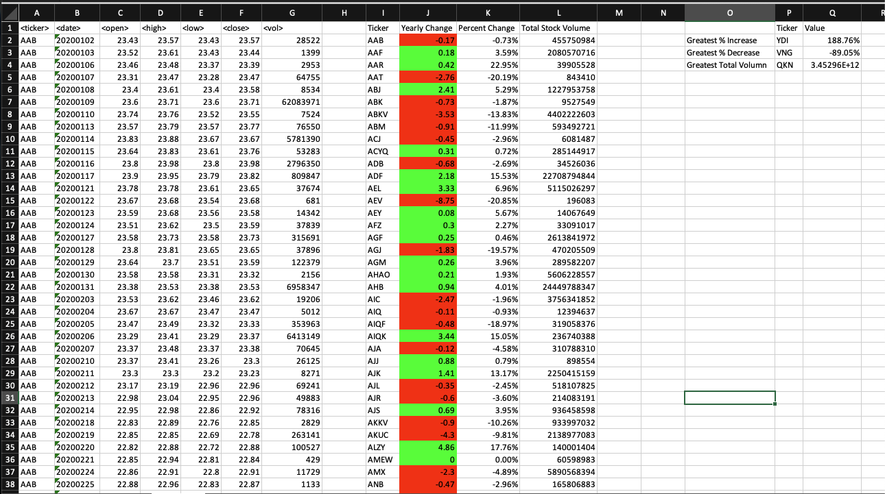

# Stock Market Data Analysis with VBA

This repository contains a VBA script for analyzing stock market data and generating summary information for multiple years. The script processes stock data for a given year, calculates various metrics, and highlights positive and negative changes. This README provides an overview of the project, instructions for using the script, and how to run it on multiple worksheets.

## Table of Contents

- [Project Overview](#project-overview)
- [Getting Started](#getting-started)
  - [Prerequisites](#prerequisites)
  - [Usage](#usage)
- [Analysis Results](#analysis-results)
- [Screenshots](#screenshots)
- [Contributing](#contributing)
- [License](#license)

## Project Overview

This project is designed for users interested in analyzing stock market data using VBA scripting within Microsoft Excel. The script processes data for a specific year and provides the following information for each stock:
- Ticker symbol
- Yearly change from the opening price to the closing price
- Percentage change from the opening price to the closing price
- Total stock volume

The script also identifies the stocks with the "Greatest % increase," "Greatest % decrease," and "Greatest total volume" for the selected year. Additionally, it applies conditional formatting to highlight positive changes in green and negative changes in red.

## Getting Started

### Prerequisites

To use this script, you need Microsoft Excel and a dataset containing stock market data. The script is designed to work with Excel's VBA environment.

### Usage

1. Download or clone this repository to your local machine.

2. Open the Excel file containing multiple worksheets, each representing data for a different year.

3. In Excel, press `ALT + F11` to open the VBA editor **OR** Click on the Developer Tag, and click Visual Basic.

4. In the VBA editor, go to `File > Import File` and select the `stock_analysis.VBA` script from this repository.

5. Once the script is imported, you can run it from the VBA editor by clicking the "Run" button or by setting up a custom button or shortcut within Excel to execute the script. Make sure the Macro or the function you run is "**ProcessAllSheets**"!!!

6. Run the ProcessAllSheets() Sub function  will analyze the data and generate the summary results for the selected year.

## Analysis Results

The script will output the following information for each stock:
- Ticker symbol
- Yearly change from the opening price to the closing price
- Percentage change from the opening price to the closing price
- Total stock volume

It will also identify and display the stocks with the "Greatest % increase," "Greatest % decrease," and "Greatest total volume" for the selected year.

## Screenshots

The `screenshots` folder in this repository contains screenshots of the analysis results for the years 2018, 2019, and 2020.

## Contributing

If you would like to contribute to this project, feel free to fork the repository, make your changes, and create a pull request. We welcome any improvements, bug fixes, or additional features.

## License

This project is licensed under the MIT License - see the [LICENSE](LICENSE) file for details.
